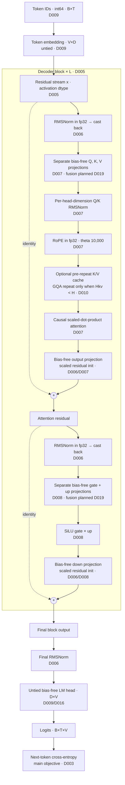

# Current architecture

Last reconciled: **2026-08-16**<br>
Architecture ID: **`dense-preln-v1`**<br>
Status: **accepted baseline**

This is the canonical, implementation-level description of the best validated
architecture family in the repository. The current highest-scoring checkpoint is
a larger profile of this same family, not a different topology. Decisions link to
the append-only [`decision ledger`](decisions.md); exact structured values are also
available in [`architecture.json`](architecture.json) for spin-off projects.

The original DeepSeek comparison explains where the model began. This document
describes what the code does now.

## Model graph

Decision IDs in the diagram link through the component table immediately below it.



The subgraph is repeated `L` times: each block's `FADD` becomes the next block's
`X0`. There is no dropout in accepted profiles.

## Piece-by-piece contract

| Piece | Current choice and ordering | Implementation | Decision |
|---|---|---|---|
| Token interface | Byte-level BPE IDs, vocabulary 16,384; maximum modeled context 512 | [`data.py`](../src/modern_lm/data.py), external tokenizer | [D009](decisions.md#d009) |
| Embedding | Learned `Embedding(V,D)`, initialized `N(0,0.02)`, not tied to output | [`model.py`](../src/modern_lm/model.py) | [D009](decisions.md#d009) |
| Residual topology | One stream; attention residual followed by feed-forward residual | [`Block`](../src/modern_lm/layers.py) | [D005](decisions.md#d005) |
| Attention input norm | RMSNorm over `D`; normalize in fp32 and cast back | [`RMSNorm`](../src/modern_lm/layers.py) | [D006](decisions.md#d006) |
| Q projection | Bias-free `D → H·Dh`; currently a separate linear | [`Attention`](../src/modern_lm/layers.py) | [D007](decisions.md#d007), [D019](decisions.md#d019) |
| K/V projections | Each bias-free `D → Hkv·Dh`; separate linears | [`Attention`](../src/modern_lm/layers.py) | [D007](decisions.md#d007), [D019](decisions.md#d019) |
| QK normalization | RMSNorm over `Dh`, applied to Q and K before RoPE | [`Attention.forward`](../src/modern_lm/layers.py) | [D007](decisions.md#d007) |
| Position | Rotary position embedding, theta 10,000; rotate Q/K in fp32, then cast back | [`build_rope_cache`](../src/modern_lm/layers.py) | [D007](decisions.md#d007) |
| Attention kernel | `torch.nn.functional.scaled_dot_product_attention`; causal for multi-token input | [`Attention.forward`](../src/modern_lm/layers.py) | [D007](decisions.md#d007) |
| Head grouping | `Dh=64`; accepted profiles use `Hkv=H` (full MHA); GQA remains configurable | [`ModernConfig`](../src/modern_lm/config.py) | [D007](decisions.md#d007) |
| K/V cache | Optional at generation; store K/V before GQA repeat; uncached remains comparison default | [`generate`](../src/modern_lm/model.py) | [D010](decisions.md#d010) |
| Attention output | Bias-free `H·Dh → D`; residual-path initialization scaled by `1/sqrt(2L)` | [`Attention`](../src/modern_lm/layers.py), [`ModernLM`](../src/modern_lm/model.py) | [D006](decisions.md#d006), [D007](decisions.md#d007) |
| FFN input norm | Separate pre-RMSNorm over `D`, fp32 calculation with cast back | [`Block`](../src/modern_lm/layers.py) | [D006](decisions.md#d006) |
| Gate/up | Two bias-free `D → F` linears, currently separate | [`SwiGLU`](../src/modern_lm/layers.py) | [D008](decisions.md#d008), [D019](decisions.md#d019) |
| Gating | Elementwise `silu(gate) * up` | [`SwiGLU.forward`](../src/modern_lm/layers.py) | [D008](decisions.md#d008) |
| FFN output | Bias-free `F → D`; residual-path initialization scaled by `1/sqrt(2L)` | [`SwiGLU`](../src/modern_lm/layers.py), [`ModernLM`](../src/modern_lm/model.py) | [D006](decisions.md#d006), [D008](decisions.md#d008) |
| Final norm | RMSNorm over `D` after the last block | [`ModernLM.forward`](../src/modern_lm/model.py) | [D006](decisions.md#d006) |
| Vocabulary head | Untied, bias-free `D → V`; a compute-bearing dense projection | [`ModernLM`](../src/modern_lm/model.py) | [D009](decisions.md#d009), [D016](decisions.md#d016) |
| Main objective | Mean next-token cross-entropy over all target positions | [`compute_loss`](../src/modern_lm/train.py) | [D003](decisions.md#d003) |
| Optional branches | MTP, MoE, and local Siamese/HybridNorm are disabled | [`ModernConfig`](../src/modern_lm/config.py) | [D011](decisions.md#d011), [D018](decisions.md#d018) |

### Load-bearing operation order

Spin-offs should treat these as part of the architecture, not interchangeable
implementation detail:

1. QK-norm happens **before** RoPE.
2. K/V enter the cache **after** RoPE and **before** any GQA repetition.
3. Cached single-token attention disables `is_causal`; its one query must see the
   complete cached prefix.
4. RMSNorm and RoPE arithmetic use fp32 but return to the activation dtype.
5. Attention is completed and added to the residual before the FFN is normalized.
6. `o_proj` and `down_proj` receive scaled initialization only after ordinary
   module initialization.
7. The embedding and vocabulary head are separate tensors.

## Current profiles

“Body” is retained as a profile name because existing run directories use it. It
means blocks plus final norm, excluding both embedding and vocabulary head. It is
**not** the canonical compute axis; the head is a large dense matmul
([D016](decisions.md#d016)).

| Profile | D | L | H/Hkv | F | Body params | Stored params | Non-embedding compute-bearing params | Status |
|---|---:|---:|---:|---:|---:|---:|---:|---|
| `5m-body` | 256 | 5 | 4/4 | 896 | 4,754,816 | 13,143,424 | 8,949,120 | measured proxy |
| `10m-body` | 320 | 7 | 5/5 | 1,088 | 10,184,256 | 20,670,016 | 15,427,136 | measured proxy |
| `20m-body` | 448 | 7 | 7/7 | 1,536 | 20,078,016 | 34,758,080 | 27,418,048 | measured proxy |
| `50m-body` | 576 | 11 | 9/9 | 1,984 | 52,324,672 | 71,199,040 | 61,761,856 | primary fast proxy |
| `100m-body` | 704 | 14 | 11/11 | 2,368 | 97,793,728 | 120,862,400 | 109,328,064 | capability onset observed |
| `dense-145m` | 768 | 15 | 12/12 | 2,432 | 119,465,088 | 144,630,912 | 132,048,000 | Phase I baseline |
| `300m-body` | 1,024 | 20 | 16/16 | 3,456 | 296,267,264 | 329,821,696 | 313,044,480 | current capability champion |
| `600m-body` | 1,280 | 24 | 20/20 | 4,352 | 558,432,512 | 600,375,552 | 579,404,032 | incomplete archived run |

All use `V=16,384`, `Tmax=512`, `Dh=64`, `norm_eps=1e-6`, RoPE theta
10,000, dropout 0, QK-norm on, untied embeddings, and the optional branches off.

For current full-MHA profiles:

```text
embedding                 = V·D
vocabulary head           = V·D
one block                 = 4D² + 3DF + 2D + 2Dh
stored parameters         = 2VD + L(4D² + 3DF + 2D + 2Dh) + D
non-embedding parameters  = stored - VD
```

The `2Dh` term is the learned Q- and K-normalization scale. GQA changes the
attention-matrix term and must be counted from the actual configuration.

## Current champion

The provisional capability champion uses the `300m-body` profile
([D014](decisions.md#d014)):

```json
{
  "architecture_id": "dense-preln-v1",
  "profile": "300m-body",
  "pretrain_checkpoint_tokens": 3450011648,
  "sft_updates": 1000,
  "development_score": {"correct": 718, "total": 5024},
  "status": "provisional"
}
```

It is the best observed checkpoint, not yet a fully controlled recipe: the parent
pretraining run is incomplete, its microbatch/accumulation setting changed during
the trajectory, and selection used the development benchmark.

## Training dataflow

Training policy is not part of checkpoint topology, but a spin-off needs it to
reproduce a trajectory.

```mermaid
flowchart LR
    DATA["Packed uint16 token stream<br/>canonical permutation · seed 2026"] --> BATCH["B×513 token windows"]
    BATCH --> SPLIT["inputs [:,:-1]<br/>labels [:,1:]"]
    SPLIT --> MODEL["dense-preln-v1<br/>fp32 parameters · bf16 autocast"]
    MODEL --> LOSS["token-mean cross-entropy"]
    LOSS --> BACK["backward + global grad clip 1.0"]
    BACK --> ROUTE{"Parameter routing<br/>D012"}
    ROUTE -->|"hidden 2-D block matrices"| MUON["Muon · LR 0.005<br/>momentum 0.95 · 5 NS steps"]
    ROUTE -->|"embedding, head, norms, routers"| ADAMW["AdamW · LR 3e-4<br/>betas .9/.95"]
    MUON --> SCHED["shared warmup/cosine shape · D013"]
    ADAMW --> SCHED
    SCHED --> CKPT["model + optimizer + RNG checkpoint"]
    CKPT --> SFT["separate concise math SFT stage<br/>AdamW 5e-5 · D015"]
    SFT --> EVAL["greedy numeric development evaluation<br/>sealed split pending · D004"]
```



Current operational defaults and caveats:

- Pretraining uses 32,768 supervised next-token targets per optimizer update.
- `64 × 1` is the default single-GPU batch shape ([D024](decisions.md#d024)); it is
  gradient-identical to the historical `16 × 4` and measured 1.04–1.09× faster
  compiled. Runs above roughly 600M body parameters pass an explicit smaller
  microbatch. The measured speedup is an upper bound until it is remeasured without
  the per-microbatch scalar syncs [D023](decisions.md#d023) removed.
- Training metrics are collected without host synchronization, and wall clock is
  attributed to disjoint segments — setup, compile/warmup, data, step, evaluation,
  checkpoint — so `training_tokens_per_second` excludes evaluation, checkpoint, and
  compile time ([D023](decisions.md#d023)). Throughput figures recorded before
  2026-08-18 are end-to-end and are not field-comparable.
- Hybrid Muon/AdamW is provisional. Its 250M loss improvement did not become a
  capability improvement and was not stable as a general claim at 2B.
- Cosine is canonical; WSD is a scoped negative at 50M with Muon.
- SFT is a separate stage and future data comparisons match supervised tokens and
  report wall time, not just examples or updates.
- Checkpoint topology includes model, optimizer, trainer state, and Python/NumPy/
  CPU/CUDA RNG state. Complete provenance manifests are planned in
  [D020](decisions.md#d020).

## Generation path

Generation is greedy. With `use_cache=false`, every step recomputes the current
prefix to preserve Phase I timing comparability. With `use_cache=true`, the first
step fills a per-layer K/V cache and later steps process one token. Tests establish
identical greedy output. Once the context is full, generation drops the cache and
uses the last 512 tokens through the uncached path ([D010](decisions.md#d010)).

For practical spin-offs, caching should normally be on. For historical reference
wall-clock comparisons, it stays off.

## Experimental branches not in current best

| Branch | Flag/path | Status | Reason |
|---|---|---|---|
| Multi-token prediction | `use_mtp` | disabled | ~15% measured throughput cost; no capability validation |
| Mixture of experts | `use_moe` | disabled | correctness-oriented routing loop, ~23% slower, no capability validation |
| Local Siamese/HybridNorm | `use_siamese_norm` | experimental | active result is not faithful to the published algorithm; [D018](decisions.md#d018) |
| GQA | `n_kv_heads < n_heads` | configurable, unused in accepted profiles | useful for inference cache memory but changes profile capacity |
| Tied embeddings | `tie_embeddings` | configurable, off | changes capacity and optimizer behavior from every champion |
| FP8/NVFP4 | wrapper/scripts | deferred | current path slower at actual hardware/scale; [D017](decisions.md#d017) |

## Spin-off checklist

A new project can ingest [`architecture.json`](architecture.json) and implement
`dense-preln-v1` without importing this repository. Before calling it equivalent:

1. Match the selected profile and exact parameter count.
2. Match all seven load-bearing ordering rules above.
3. Load a converted checkpoint and compare eager fp32 logits.
4. Compare bf16-autocast loss and input/parameter gradients.
5. Compare one optimizer step for the selected optimizer recipe.
6. Compare cached and uncached greedy generation, including EOS and maximum-context
   behavior.
7. Compare checkpoint save/resume on the immediately following step.
8. Record any intentional divergence as a new architecture ID and decision.

Do not copy the current hardcoded corpus path from `data.py`; make artifacts
configurable and hash them in the run manifest.

## Known implementation debt

- Q/K/V and gate/up are separate linears despite shape benchmarks assuming fusion.
- `sft.py` still converts loss, supervised-token counts, and its finiteness guard
  per example; pretraining no longer does ([D023](decisions.md#d023)).
- No run reports MFU: it is emitted only when a measured device peak is declared.
- A partial final token budget counts only the requested remainder but computes the
  gradient over a full batch.
- Run and evaluation metadata lack complete code/data/environment identity.
- The numeric benchmark is a development suite after adaptive use; a sealed suite
  is not implemented yet.

These are priorities in [`PROJECT_MEMORY.md`](../PROJECT_MEMORY.md), not hidden
properties of the architecture.
